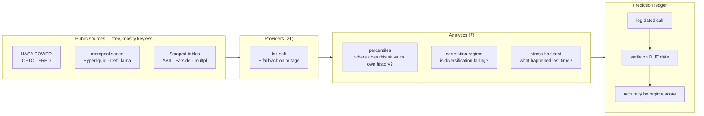

# terminalq-extensions

An extension pack of market-data providers, analytics modules, and workflow commands
for [TerminalQ](https://github.com/fakoli/terminalq), a Bloomberg-style financial
terminal that runs as a Claude Code plugin.

**32 modules, 36 test files, ~9,400 lines.** Every data source added here is free and
most require no API key at all.

## About this project

I'm an undergraduate studying finance and business analytics, and I built this to
answer a question I kept running into: how much of an institutional market-data setup
can you reconstruct from public sources, for nothing?

That framing matters for how you should read the code. **I'm not a professional
software engineer, and this isn't production infrastructure.** It's a working tool I
use for my own market research, built while learning. Some of the choices here are
deliberate tradeoffs I can defend; others are probably just things I didn't know a
better way to do yet, and I'd genuinely like to be told which is which.

Things I already know are rough, so you don't have to hunt for them:

- The HTML scrapers parse tables with regex rather than a real parser. That avoids a
  dependency for what is simple table extraction, and every caller fails soft — but
  it's the classic thing to flag, and I'd rather name it than have it found.
- Four of the test files exercise TerminalQ's own modules rather than mine, so they
  won't run against this repo alone (see [Testing](#testing)).
- `_html.py` is the one module with no direct test coverage.

**Issues and PRs are welcome, including blunt ones.** If something here is wrong or
naive, I'd rather hear it than keep shipping it.

---

## What this adds

TerminalQ ships with quotes, fundamentals, and core macro data. This pack extends it in
four directions.

### 1. Free, keyless data providers

Institutional market data is expensive. Every provider here reaches a public source
directly — a government API, an exchange's public endpoint, or a scraped public table —
so the whole pack runs at zero marginal cost.

| Module | Source | What it gives you |
|---|---|---|
| `climate.py` | NASA POWER | Temperature and precipitation anomalies vs the 2001–2020 normal, across commodity-production regions |
| `cftc.py` | CFTC | Commitment of Traders futures positioning — commercial vs speculative |
| `defillama.py` | DefiLlama | DeFi total-value-locked and stablecoin supply |
| `etf_flows.py` | Farside | Daily spot Bitcoin ETF flows |
| `mempool.py` | mempool.space | Bitcoin fee and congestion microstructure |
| `hyperliquid.py` | Hyperliquid | Perpetual funding rates and open interest |
| `prediction_markets.py` | Polymarket | Live prediction-market odds |
| `fed_calendar.py` | federalreserve.gov | FOMC meeting schedule |
| `options_flow.py` | Yahoo option chains | Dealer gamma exposure and call/put walls |
| `retail_sentiment.py` | AAII + Yahoo | Weekly bull-bear survey and SPY put/call ratio |
| `sectors.py` | Yahoo | 11 SPDR sector ETFs measured against SPY |
| `valuation.py` | multiple | Shiller CAPE, earnings yield, equity risk premium |
| `cycle.py` | FRED | Six-signal recession dashboard (Sahm rule, yield curves, claims, NFCI) |

### 2. Analytics that add historical context

A raw number is close to meaningless without knowing where it sits in its own history.
These modules answer "is this normal?" rather than just "what is this?".

- **`percentiles.py`** — converts any metric into its percentile against its full history.
  A high-yield spread of 3.2% means nothing on its own; *3.2%, the 2nd percentile of the
  last 30 years* means credit markets are priced for near-perfection.
- **`correlation.py` / `correlation_regime.py`** — cross-asset correlation matrix, plus
  detection of when correlations are *tightening*. Assets moving together is a risk signal
  that individual asset prices hide, because it means diversification has stopped working.
- **`stress_backtest.py` / `backtest_utils.py`** — a registry for asking what actually
  happened to prices during comparable historical stress windows.
- **`fred_archive.py`** — a local archive of FRED series. Built after a data vendor
  retroactively truncated a series' history behind a license change; archiving locally
  means past analysis stays reproducible.

### 3. A self-grading prediction ledger

The part I'd point at first. Analysis that is never scored drifts toward being
unfalsifiable, so this makes it falsifiable by construction:

- **`history.py`** — append-only local store of dated regime snapshots and logged predictions.
- **`prediction_grader.py`** — settles each prediction automatically once its horizon
  elapses, by comparing against realized prices. No opportunity to quietly forget a bad
  call. Each call settles on the close at its **due date**, not on whatever day grading
  happens to run — grading is lazy, so pricing at run-time would silently turn a 30-day
  call into a 45-day one and record a horizon nobody predicted.
- **`regime_history.py`** — measures realized forward returns grouped by what the model
  scored at the time, which is what tells you whether the scoring weights actually predict
  anything or just feel plausible.
- **`backfill.py`** — reconstructs the snapshot store from previously written reports.

### 4. Resilience and tooling

- **Fallback providers** — `yahoo_crypto.py` and `hyperliquid.py` take over when the
  primary source is rate-limited or down, so a single upstream outage doesn't kill a report.
- **`_lazy_yfinance.py`** — defers a heavy import until first use, cutting cold-start time.
- **`scripts/fr_collect.py`** — runs data collection out-of-process and emits a compact
  brief, which substantially reduces the token cost of a full report.
- **`scripts/adv.py`** — computes average daily volume from raw OHLCV rather than trusting
  an aggregator's figure, and reports the median (the mean is skewed by rebalance days).
- **`voice.py`** — spoken briefings through the macOS `say` command.

---

## How it fits together



The left-to-right path is the whole idea: pull a number from a free source, place it in
its own historical distribution so it means something, then commit to a dated call and
grade it later whether it worked or not.

## What the output looks like

`scripts/adv.py` computes average daily volume straight from OHLCV bars, so a claim
about a large flow can be sized against real liquidity instead of an aggregator's
figure. Actual output, run against three large caps:

```
$ python scripts/adv.py AAPL MSFT NVDA --flow 1.0e9

TKR       $ADV mean   $ADV MEDIAN     $ADV 20d   sh ADV med   spiky
-------------------------------------------------------------------
AAPL    $16,716.97M   $15,016.29M  $15,979.70M   48,535,150    5.4x
MSFT    $15,605.59M   $13,429.72M  $12,468.76M   33,034,250    5.6x
NVDA    $32,125.79M   $30,518.71M  $26,385.34M  148,628,350    1.9x

window: 3mo — 62 bars, 2026-04-29 to 2026-07-28

Sizing $1,000M of flow against MEDIAN $ADV (the conservative read):
  AAPL       0.1x ADV  =     0.1 days of volume
  MSFT       0.1x ADV  =     0.1 days of volume
  NVDA       0.0x ADV  =     0.0 days of volume

Prefer the MEDIAN for sizing — the mean is inflated by rebalance/earnings prints.
Spiky names (>3x) disrupt more than days-of-volume implies: the flow day is not this average day.
Yahoo consolidated tape (incl. off-exchange prints); order-of-magnitude, not a filing.
```

Two things that output is deliberately doing. It reports the **median alongside the
mean**, because rebalance and earnings days produce volume prints many times a normal
day and drag the mean above what the stock actually absorbs — AAPL's spikiness of 5.4x
says its busiest day was over five times its median one. And it **restates its own
caveats every run**, so a number can't get quoted later without the limits attached.

## Installation

These modules import from TerminalQ's internals (`terminalq.cache`, `terminalq.config`,
`terminalq.logging_config`, `terminalq.rate_limiter`, and several of its base providers).
**This is an extension pack, not a standalone application** — it needs a TerminalQ
checkout to run against.

```bash
git clone https://github.com/fakoli/terminalq.git
git clone https://github.com/Deadmonkk/terminalq-extensions.git

# overlay the extension files onto the TerminalQ tree
cp -r terminalq-extensions/src/terminalq/*      terminalq/src/terminalq/
cp -r terminalq-extensions/commands/*           terminalq/commands/
cp -r terminalq-extensions/tests/*              terminalq/tests/
cp -r terminalq-extensions/scripts              terminalq/

cd terminalq && uv sync && uv run pytest
```

New providers still need registering as MCP tools in TerminalQ's `server.py`. Those
registrations are edits to upstream files and so are not included here.

### Dependencies

`httpx`, `pandas`, `yfinance`, and `pytest` for the test suite. All are already TerminalQ
dependencies except `pandas`.

---

## Testing

36 test files, **319 tests, all passing** against a TerminalQ checkout with this pack
overlaid. Network calls are mocked throughout, so the suite runs offline and
deterministically — no API keys or live endpoints needed.

```bash
uv run pytest tests/
```

Two caveats worth stating plainly:

- **Four test files exercise TerminalQ's own modules**, not mine —
  `test_coingecko.py`, `test_metric_context.py`, `test_release_calendar.py`, and
  `test_trending_fallback.py` target upstream's `coingecko`, `fred`, and `finnhub`
  providers. I wrote those tests, but they cover upstream code, so the honest count
  of tests covering *this pack* is 32 files.
- **`_html.py` has no direct test.** It's small, but it's the shared parsing helper
  behind four scraped providers, so it's the least-covered thing that matters most.

CI runs the suite on every push by checking out TerminalQ, overlaying this pack, and
running pytest — see [`.github/workflows/tests.yml`](.github/workflows/tests.yml).

---

## Design notes

A few constraints shaped this code, and they are the parts worth reading:

**Free sources only.** Every provider is either a government API, a public exchange
endpoint, or a scraped public table. No paid data feeds and, for most of them, no API key.

**Assume sources break.** Scraped tables change layout and public APIs rate-limit. Providers
fail soft and hand off to a fallback rather than taking down an entire report.

**Never invent a number.** When a source fails, the report says the data is unavailable.
It does not interpolate, estimate, or fill the gap from memory — a plausible fabricated
figure is worse than an acknowledged hole.

**Percentiles over raw values.** A metric without historical context invites confident
misreadings.

**Predictions get graded.** See the ledger above.

---

## Credits

Built as an extension to [TerminalQ](https://github.com/fakoli/terminalq) by Sekou
Doumbouya. This repository contains only my own original modules; no upstream code is
redistributed here.

## License

MIT — see [LICENSE](LICENSE).
