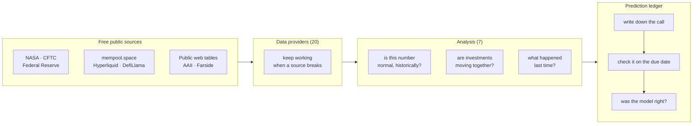

# terminalq-extensions

[](https://github.com/Deadmonkk/terminalq-extensions/actions/workflows/tests.yml)
[](LICENSE)
[](https://www.python.org/)

Add-on modules for [TerminalQ](https://github.com/fakoli/terminalq), a financial
terminal that runs inside Claude Code. This pack adds 20 new data sources, some
analysis tools, and a system that grades its own market predictions.

32 modules, 166 tests, about 8,900 lines. Almost every data source here is free, and
most need no API key.

## Why I built it

A Bloomberg terminal costs around $24,000 a year. I'm a college student, so that was
never going to happen. But a lot of what those terminals show is public data that
someone has packaged nicely. So I wanted to find out how much of it I could rebuild
myself, for free.

The answer turned out to be: quite a lot. Government agencies publish most economic
data. Exchanges publish prices. The Fed publishes its own calendar. NASA publishes
weather data you can use to watch crop-growing regions. None of it costs anything if
you're willing to write the code to go and get it.

**A note on what this is.** I'm studying finance and business analytics, not computer
science. This is a tool I actually use for my own market research, and I built it
while learning to code properly. Some of the decisions here I can explain and defend.
Others are probably just me not knowing a better way yet. I'd honestly like to know
which is which, so if you spot something wrong, please tell me.

A few things I already know could be better, so you don't have to go looking:

- The web scrapers pull data out of HTML tables using pattern matching instead of a
  proper HTML parser. It works and it avoids adding a dependency, but it's the kind of
  shortcut people rightly complain about.
- One file, `_html.py`, has no tests of its own, and four of the scrapers depend on it.
  That's the weakest spot in the test coverage.
- A couple of modules (`reports.py`, `backfill.py`) only make sense if you're using the
  full report workflow. Read on their own, they'll look like they don't do much.

---

## What's in it

### Free data sources

Each of these goes straight to a public source and pulls the data down. No paid feeds,
and for most of them, no signup either.

| Module | Where the data comes from | What you get |
|---|---|---|
| `climate.py` | NASA | How hot and how wet key farming and mining regions are, compared to their 20-year normal |
| `cftc.py` | US futures regulator | Who's betting which way in futures markets |
| `defillama.py` | DefiLlama | How much money is sitting in crypto lending and trading apps |
| `etf_flows.py` | Farside | Money going into and out of Bitcoin ETFs each day |
| `mempool.py` | mempool.space | How congested the Bitcoin network is and what fees people are paying |
| `hyperliquid.py` | Hyperliquid exchange | Crypto derivatives positioning |
| `prediction_markets.py` | Polymarket | What people are actually betting on real-world events |
| `fed_calendar.py` | The Federal Reserve | When the Fed next meets |
| `options_flow.py` | Yahoo options data | Where big options positions sit, and the price levels they tend to pin the market to |
| `retail_sentiment.py` | AAII survey + Yahoo | Whether ordinary investors are feeling bullish or scared |
| `sectors.py` | Yahoo | Which parts of the stock market are leading and which are lagging |
| `valuation.py` | Several | Whether the stock market looks expensive by long-run historical standards |
| `cycle.py` | Federal Reserve data | Six recession warning signals in one place |

### Putting numbers in context

A number on its own usually doesn't tell you much. If I say credit spreads are 3.2%,
that means nothing unless you know whether 3.2% is normal. These modules answer that.

- **`percentiles.py`** takes any number and tells you where it sits in its own history.
  "Credit spreads are 3.2%" becomes "credit spreads are lower than they've been 98% of
  the time in the last 30 years," which tells you something real: lenders are relaxed,
  maybe too relaxed.
- **`correlation.py`** and **`correlation_regime.py`** check whether different
  investments are starting to move together. When everything moves as one, spreading
  your money around stops protecting you. That's worth knowing before it matters.
- **`stress_backtest.py`** looks up what actually happened to prices during past
  periods that resembled today.
- **`fred_archive.py`** keeps a local copy of economic data. I added this after a data
  provider quietly deleted years of history I'd been relying on. Now old analysis stays
  reproducible.

### Grading its own predictions

This is the part I'd point at first.

It's easy to write market commentary that sounds smart and never check whether it was
right. Bad calls get forgotten and good ones get retold. So this keeps score whether I
like it or not.

- **`history.py`** writes down every prediction with a date and a deadline.
- **`prediction_grader.py`** goes back once the deadline passes and checks what actually
  happened. There's no step where I get to quietly drop a bad call.
- **`regime_history.py`** groups past predictions by how confident the scoring model was
  at the time, then shows what returns actually followed. That's the test of whether the
  model predicts anything or just sounds convincing.

One detail worth mentioning, because getting it wrong ruins the whole thing. A
prediction has to be judged on the day it was due, not the day I happen to check it. If
I make a 30-day call and check it six weeks later, I'm measuring 44 days, not 30, and my
track record becomes meaningless. This originally had that bug. It's fixed, with tests.

### Keeping it running

- **Backups when a source breaks.** Free data sources go down or rate-limit you. When
  the main crypto source fails, `yahoo_crypto.py` and `hyperliquid.py` step in so one
  outage doesn't take down a whole report.
- **`_lazy_yfinance.py`** delays loading a slow library until something actually needs
  it, which makes startup noticeably faster.
- **`scripts/fr_collect.py`** gathers data in a separate process and hands back a short
  summary, which cuts the cost of generating a full report considerably.
- **`scripts/adv.py`** works out how much a stock normally trades, calculated from raw
  price data rather than trusting a website's number.
- **`voice.py`** reads a market briefing out loud on a Mac.

---

## How the pieces fit



Reading left to right, that's the whole idea. Get a number from somewhere free. Work out
whether it's unusual. Make a call based on it. Then go back later and find out if you
were right.

## What it looks like when you run it

`scripts/adv.py` works out how much a stock normally trades in a day. That matters if
you're trying to judge whether some big buy or sell order is actually large enough to
move the price. Here's a real run:

```
$ python scripts/adv.py AAPL MSFT NVDA --flow 1.0e9

TKR       $ADV mean   $ADV MEDIAN     $ADV 20d   sh ADV med   spiky
-------------------------------------------------------------------
AAPL    $16,716.97M   $15,016.29M  $15,979.70M   48,535,150    5.4x
MSFT    $15,605.59M   $13,429.72M  $12,468.76M   33,034,250    5.6x
NVDA    $32,125.79M   $30,518.71M  $26,385.34M  148,628,350    1.9x

window: 3mo — 62 bars, 2026-04-29 to 2026-07-28

Sizing $1,000M of flow against MEDIAN $ADV (the conservative read):
  AAPL       0.1x ADV  =     0.1 days of volume
  MSFT       0.1x ADV  =     0.1 days of volume
  NVDA       0.0x ADV  =     0.0 days of volume

Prefer the MEDIAN for sizing — the mean is inflated by rebalance/earnings prints.
Spiky names (>3x) disrupt more than days-of-volume implies: the flow day is not this average day.
Yahoo consolidated tape (incl. off-exchange prints); order-of-magnitude, not a filing.
```

Two things it's deliberately doing. It shows the median next to the average, because a
handful of unusually busy days pull the average up and make a stock look more liquid
than it really is on a normal day. AAPL's "5.4x" means its busiest day was over five
times its typical one. And it repeats its own warnings every single time, so nobody
quotes the number later without the caveats attached.

---

## Installing it

These modules are built to sit inside TerminalQ and use its plumbing, so **this isn't a
standalone program.** You need a copy of TerminalQ to add it to.

```bash
git clone https://github.com/fakoli/terminalq.git
git clone https://github.com/Deadmonkk/terminalq-extensions.git

# copy the extension files into the TerminalQ folder
cp -r terminalq-extensions/src/terminalq/*      terminalq/src/terminalq/
cp -r terminalq-extensions/commands/*           terminalq/commands/
cp -r terminalq-extensions/tests/*              terminalq/tests/
cp -r terminalq-extensions/scripts              terminalq/

cd terminalq && uv sync && uv run pytest
```

Two things aren't included, because both mean editing TerminalQ's own files rather than
adding new ones:

1. **Registering the new tools.** The new data providers need adding to TerminalQ's
   `server.py` before Claude can call them by name.
2. **Wiring up the backups.** The Yahoo and Hyperliquid fallbacks kick in from inside
   TerminalQ's own crypto module, so that file needs a small hook added. Without it
   everything still works when called directly. Only the automatic switchover is
   inactive.

Settings are handled for you. `ext_settings.py` holds the roughly 55 thresholds and
timing values this pack needs. If TerminalQ already defines one of them, its value wins.
So you don't have to edit any config file to get started.

### What it needs installed

`httpx`, `pandas`, `yfinance`, and `pytest` for the tests. TerminalQ already includes
everything except `pandas`.

## Tests

31 test files, 166 tests. Every test covers something in this pack. All the network
calls are faked, so the tests run offline, instantly, and give the same answer every
time. No API keys needed.

```bash
uv run pytest tests/
```

On a fresh TerminalQ copy, 156 pass and 10 skip. All 166 pass once you've added the
hook described above. The 10 that skip are testing the automatic backup switchover,
which can't happen until that hook exists. They skip with a message explaining exactly
what's missing, rather than failing and making it look like something's broken.

The tests run automatically on every change through GitHub Actions, on a clean machine
rather than just mine.

---

## A few things I decided on purpose

**Free sources only.** Every single source here is a government agency, a public
exchange, or a public web page. Nothing costs money and most needs no signup.

**Assume sources will break.** Free things go down, change their page layout, or block
you for asking too often. So nothing here crashes when a source fails. It reports the
failure and, where possible, tries somewhere else.

**Never guess a number.** If a source fails, the report says the data is unavailable. It
does not estimate, fill in from last time, or quietly leave in a stale figure. A
made-up number that looks reasonable is far more dangerous than an obvious gap.

**Context beats raw numbers.** A number without history invites confident nonsense. See
the percentiles section above.

**Predictions get graded.** Covered above, but it's the thing I'd defend hardest.

---

## Credits

Built as an add-on to [TerminalQ](https://github.com/fakoli/terminalq) by Sekou
Doumbouya. Everything in this repository is my own code. None of TerminalQ's code is
copied here.

## Licence

MIT, so you can do essentially whatever you like with it. See [LICENSE](LICENSE).
